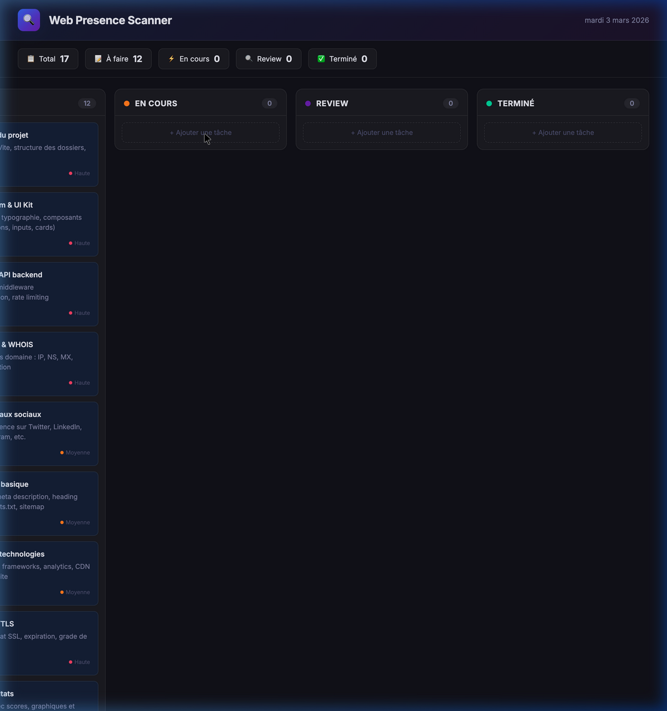

# 🔍 Web Presence Scanner — Trello Board

## Ce qui a été créé

Un **board Trello interactif** dans [index.html](file:///Users/theo/Developer/web-presence-scanner/index.html) avec :

- **5 colonnes** : Backlog → À faire → En cours → Review → Terminé
- **17 tâches** pré-remplies couvrant toute l'architecture du scanner
- **Drag & drop** pour déplacer les cartes entre colonnes
- **Modal d'ajout** avec titre, description, tag et priorité
- **Persistance** via `localStorage`
- **Design** dark glassmorphism premium

## Aperçu



## Tâches pré-remplies

| Catégorie | Tâches |
|-----------|--------|
| **DevOps** | Setup projet (Next.js/Vite, ESLint) |
| **Design** | Design System, UI Kit, Mode sombre/clair |
| **Backend** | Scanner DNS/WHOIS, SEO, Technologies, SSL, Performance |
| **API** | Architecture REST, Scanner réseaux sociaux |
| **Frontend** | Formulaire recherche, Page résultats, Export PDF, i18n |
| **Data** | Historique des scans |
| **Test** | Tests unitaires & intégration |

## Vérification

- ✅ Board affiché avec les 5 colonnes et toutes les cartes
- ✅ Barre de stats avec décompte par colonne
- ✅ Bouton "+ Ajouter une tâche" fonctionnel
- ✅ Thème glassmorphism dark propre et moderne

## Comment l'ouvrir

```bash
open /Users/theo/Developer/web-presence-scanner/index.html
```
